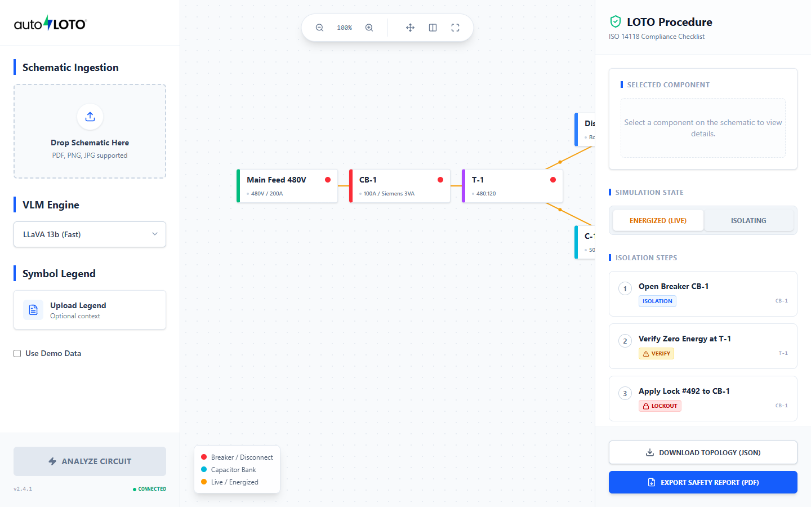
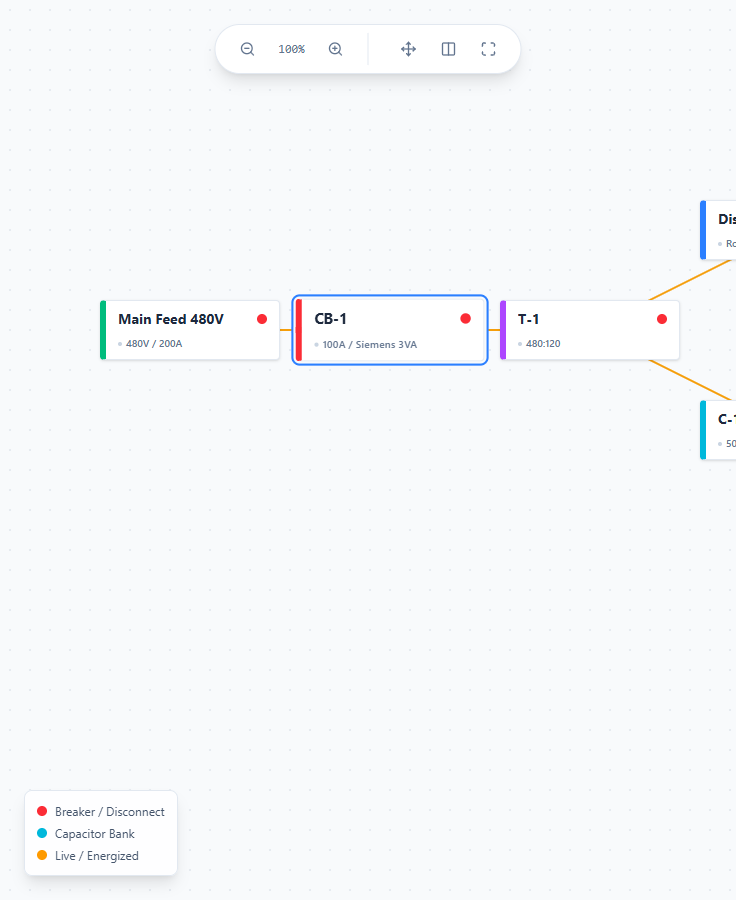
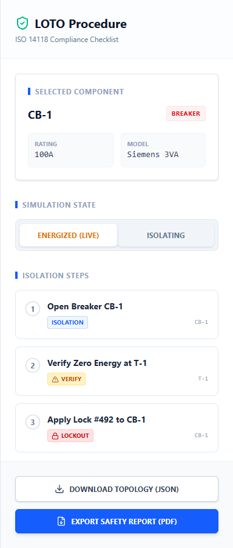
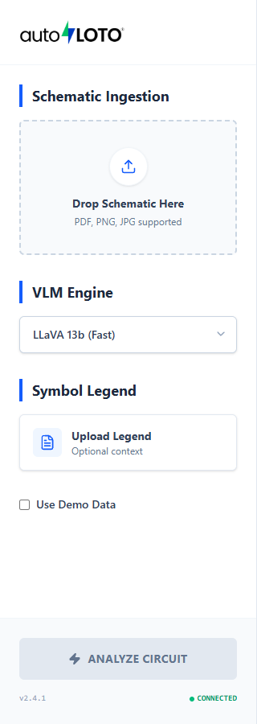
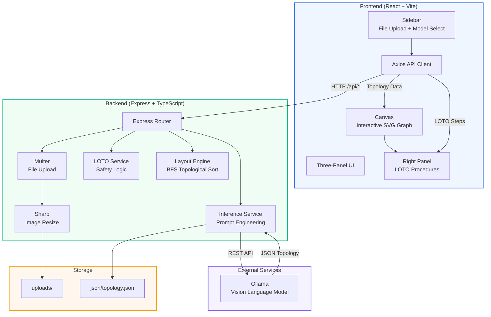
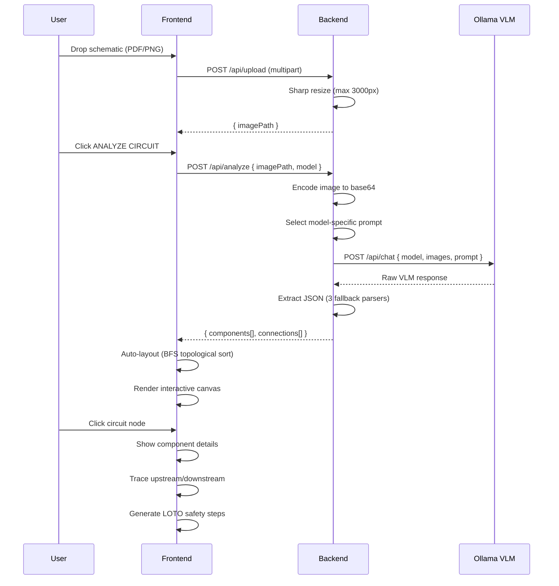
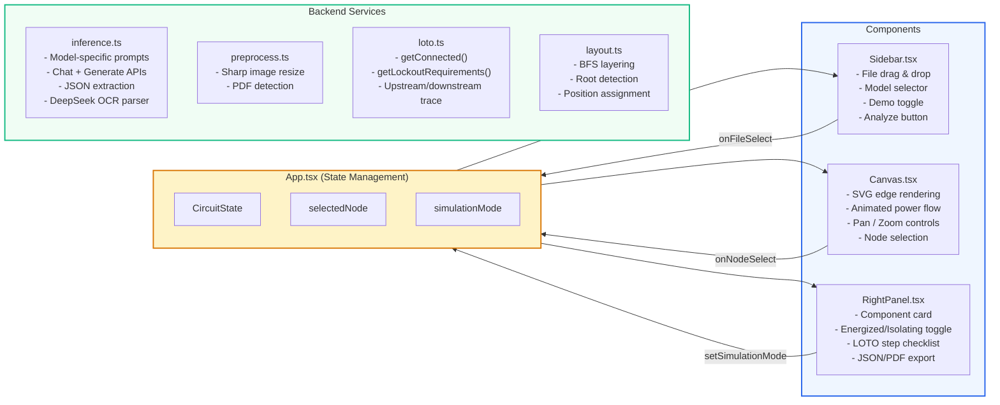
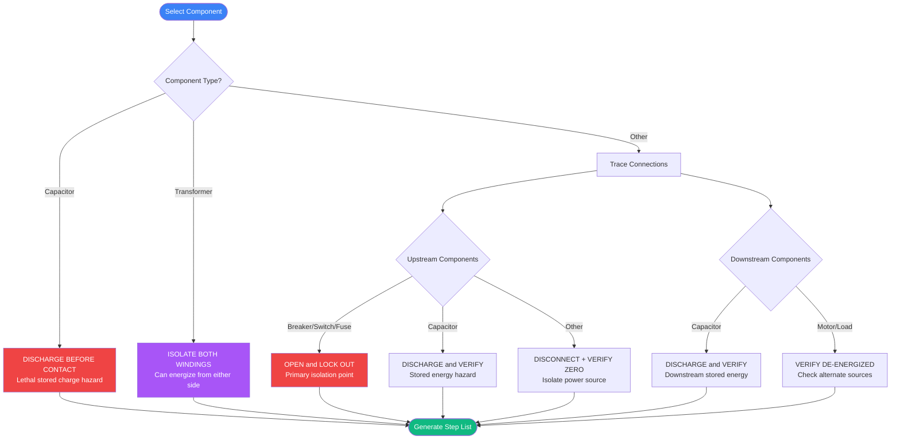
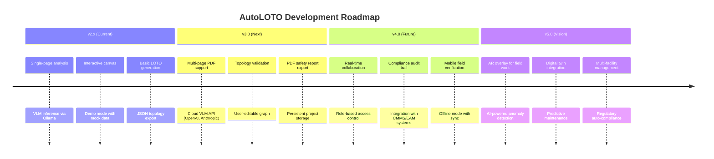
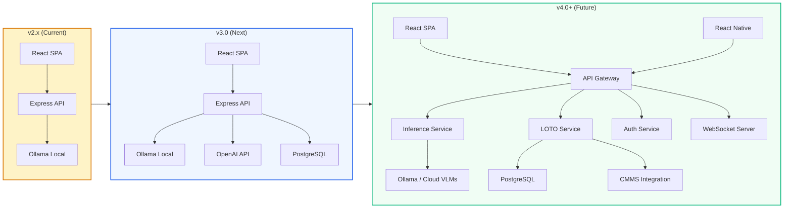

<p align="center">
  
</p>

<h1 align="center">AutoLOTO</h1>

<p align="center">
  <strong>Automatic Lockout/Tagout Circuit Diagram Analyzer</strong><br/>
  Analyze electrical schematics with Vision Language Models and generate interactive LOTO safety procedures.
</p>

<p align="center">
  
  
  
  
  
</p>

<p align="center">
  <a href="https:
//autoloto-demo.onrender.com"><strong>Live Demo</strong></a>
</p>

---

## Screenshots

### Full Application View


| Interactive Canvas | LOTO Procedure Panel | Sidebar Upload |
|---|---|---|
|  |  |  |

---

## Features

- **Drag-and-Drop Upload** - Drop circuit schematics (PDF, PNG, JPG) directly into the sidebar
- **VLM Analysis** - Ollama vision models extract components and connections from diagrams
- **Interactive Canvas** - Pan, zoom, animated power flow visualization with node selection
- **LOTO Procedures** - Auto-generated lockout/tagout safety steps per ISO 14118
- **Simulation Modes** - Toggle between Energized (live) and Isolating views
- **Demo Mode** - Built-in demo topology for testing without Ollama
- **Topology Export** - Download extracted circuit data as JSON

## Quick Start

```bash
# Install all dependencies (single command, npm workspaces)
npm install

# Start both frontend and backend
npm run dev
```

| Service | URL |
|---------|-----|
| Frontend | http://localhost:5173 |
| Backend API | http://localhost:3001 |
| Live Demo | https://autoloto-demo.onrender.com |

## Prerequisites

- **Node.js** 18+
- **Ollama** running locally with a vision model:
  ```bash
  ollama serve
  ollama pull llava:13b
  ```
- **Poppler** (optional, for PDF upload support)
- **OpenAI API Key** (optional, for cloud deployment without Ollama)

## Deploy to Render

1. Push your repo to GitHub
2. On [Render](https://render.com), create a **New Web Service** and connect your repo
3. Render will auto-detect `render.yaml`. Or configure manually:
   - **Build Command:** `npm install && npm run build`
   - **Start Command:** `npm run start -w backend`
4. Add environment variable `OPENAI_API_KEY` with your OpenAI key
5. Select the **GPT-4o Vision (Cloud)** model in the UI since Render has no GPU for Ollama

The backend serves the frontend static build automatically in production.

## Architecture

```
autoloto-demo/
├── frontend/                # Vite + React + TypeScript + Tailwind CSS
│   ├── src/
│   │   ├── components/      # Sidebar, Canvas, RightPanel + 47 shadcn/ui components
│   │   ├── lib/             # mockData, axios API client
│   │   ├── styles/          # Tailwind v4 globals with CSS variables
│   │   ├── assets/          # Logo and static assets
│   │   └── App.tsx          # Main three-panel layout with API integration
│   ├── public/              # Favicon
│   └── vite.config.ts       # Vite + Tailwind plugin + API proxy
│
├── backend/                 # Express + TypeScript
│   ├── src/
│   │   ├── services/
│   │   │   ├── inference.ts # Ollama VLM communication (chat + generate APIs)
│   │   │   ├── preprocess.ts# Image resizing via sharp
│   │   │   └── loto.ts      # LOTO safety logic (upstream/downstream tracing)
│   │   ├── utils/
│   │   │   └── layout.ts    # BFS topological layering for auto-layout
│   │   ├── types.ts         # Shared TypeScript interfaces
│   │   └── server.ts        # Express routes
│   ├── uploads/             # Temporary file storage
│   └── .env                 # Port and Ollama URL config
│
├── img/                     # Logo and screenshots
├── diagram/                 # Example circuit schematics
├── json/                    # Extracted topology data
└── package.json             # Root: concurrently runs both services
```

## System Design

### High-Level Architecture



### Data Flow Pipeline



### Component Architecture



### LOTO Safety Decision Tree



### How It Works

1. **Upload** a circuit schematic via drag-and-drop or file picker
2. **Analyze** sends the image to Ollama with a model-specific prompt
3. **Parse** extracts structured JSON (components + connections) with 3 fallback parsers
4. **Layout** positions nodes using BFS topological layering
5. **Render** displays the interactive canvas with animated power flow
6. **Select** a node to see component details and auto-generated LOTO steps

## API Endpoints

| Method | Path | Description |
|--------|------|-------------|
| `GET` | `/api/health` | Health check |
| `POST` | `/api/upload` | Upload schematic file (multipart/form-data) |
| `POST` | `/api/analyze` | Analyze diagram via Ollama VLM |
| `POST` | `/api/loto` | Generate LOTO steps for a component |
| `POST` | `/api/layout` | Auto-layout topology nodes |

## Supported Models

| Model | Strengths |
|-------|-----------|
| `llava:13b` | Best accuracy for complex schematics |
| `llava:7b` | Good balance of speed and accuracy |
| `llava:latest` | Latest LLaVA release |
| `qwen3-vl:latest` | Optimized for circuit analysis |
| `deepseek-ocr:latest` | Strong text and label extraction |
| `gpt-4o` | Cloud-based, no GPU required (needs API key) |

## LOTO Safety Logic

The system traces upstream and downstream connections to generate safety procedures:

| Component Type | Generated Action |
|----------------|-----------------|
| Breaker / Switch / Disconnect | OPEN and LOCK OUT |
| Capacitor | DISCHARGE BEFORE CONTACT |
| Transformer | ISOLATE BOTH PRIMARY AND SECONDARY |
| Motor / Load | VERIFY DE-ENERGIZED |
| Power Source | DISCONNECT and VERIFY ZERO ENERGY |

## Configuration

Backend settings via `backend/.env`:

```env
PORT=3001
OLLAMA_BASE_URL=http://localhost:11434
```

## Tech Stack

| Layer | Technology |
|-------|-----------|
| Frontend Framework | React 18 + TypeScript |
| Build Tool | Vite 7 |
| Styling | Tailwind CSS v4 + shadcn/ui |
| Animations | Motion (Framer Motion) |
| Icons | Lucide React |
| Backend | Express 5 + TypeScript |
| Image Processing | Sharp |
| VLM Communication | Axios to Ollama REST API |
| Dev Runner | Concurrently |

## Limitations

- Single-page PDF analysis only
- Requires local Ollama instance (no cloud API fallback)
- No validation or correction of extracted topology
- PDF upload requires poppler installed on the system

## Future Development

### Roadmap



### Planned Features

#### Near-term (v3.0)

| Feature | Description | Priority |
|---------|-------------|----------|
| Multi-page PDF | Analyze all pages of a schematic PDF, merge topologies | High |
| Cloud VLM support | Add OpenAI GPT-4o Vision and Anthropic Claude as model options | High |
| Topology editor | Drag nodes, add/remove connections directly on the canvas | High |
| Topology validation | Cross-check extracted components against known patterns, flag anomalies | Medium |
| PDF report export | Generate formatted safety report PDF with LOTO checklist | Medium |
| Project persistence | Save/load projects with database backend (SQLite or PostgreSQL) | Medium |
| Undo/redo | History stack for all topology and LOTO step modifications | Low |

#### Mid-term (v4.0)

| Feature | Description | Priority |
|---------|-------------|----------|
| Real-time collaboration | Multiple users editing the same topology via WebSocket | High |
| Authentication & RBAC | User accounts, role-based permissions (viewer, editor, admin) | High |
| Audit trail | Log all LOTO procedure changes with timestamps and user attribution | High |
| CMMS integration | Connect with Maximo, SAP PM, or other maintenance management systems | Medium |
| Mobile app | React Native companion app for field verification with camera capture | Medium |
| Offline mode | Service worker caching, sync when reconnected | Medium |
| Batch analysis | Upload multiple schematics and process them in a queue | Low |

#### Long-term (v5.0)

| Feature | Description | Priority |
|---------|-------------|----------|
| AR field overlay | Camera overlay showing LOTO steps on physical equipment | Exploratory |
| Anomaly detection | ML model to detect wiring errors or missing safety components | Exploratory |
| Digital twin | Live connection to SCADA/PLC for real-time energy state monitoring | Exploratory |
| Predictive maintenance | Use historical data to predict component failures | Exploratory |
| Multi-facility | Manage schematics and LOTO procedures across multiple sites | Exploratory |
| Regulatory compliance | Auto-generate OSHA/NFPA 70E/CSA Z460 compliance documentation | Exploratory |

### Architecture Evolution



### Contributing

Contributions are welcome. To get started:

1. Fork the repository
2. Create a feature branch (`git checkout -b feature/my-feature`)
3. Make changes and test (`npm run dev`)
4. Submit a pull request
